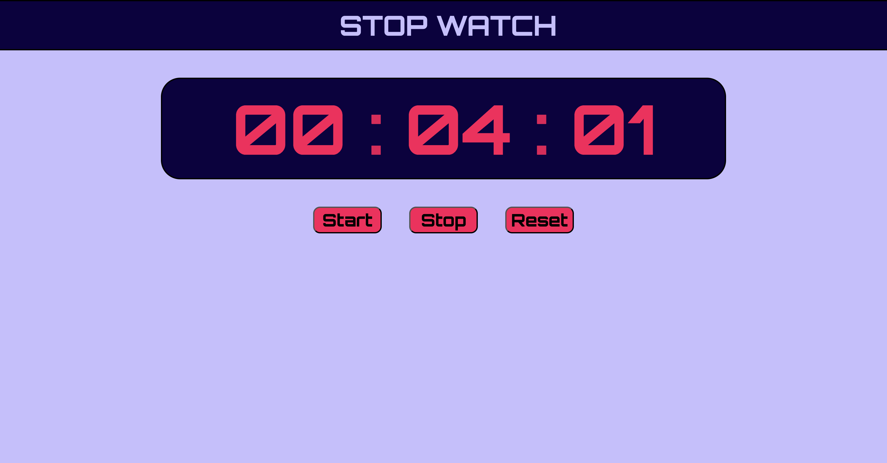

# ⏱ Stopwatch Web App

A simple and responsive stopwatch built using HTML, CSS, and JavaScript.

---
## 📸 Preview

## 🚀 Features

* Start / Stop / Reset functionality
* Tracks Minutes, Seconds, and Milliseconds
* Prevents multiple timers from running
* Clean and simple UI

---

## 🛠 Tech Stack

* HTML
* CSS
* JavaScript (Vanilla JS)

---

## 📂 Project Structure

* `stopwatch.html` → Structure
* `stopwatch.css` → Styling
* `stopwatch.js` → Logic for Hour-Min-Sec
* `millisecond.js` → Logic for Min-Sec-Millisec

---

## ▶️ How to Run

1. Download or clone this repository
2. Open `stopwatch.html` in your browser

---

## 🎯 Future Improvements

* Add Lap feature
* Improve UI design
* Make it mobile responsive
* Add sound or animations

---

## 👨‍💻 Author

Adarsh Panchal
